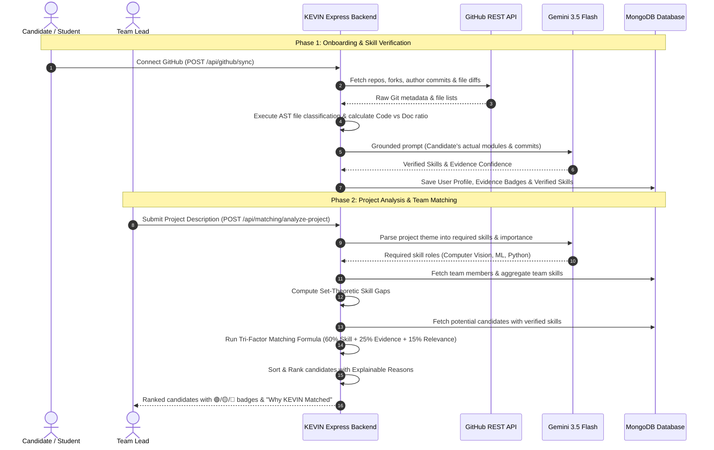

# KEVIN — A Trust-Based Skill Exchange & Team Formation Platform for College Students

> **Team Innovate365** | **DSU DEVHACK 3.0**  
> **Institution:** Sahyadri College of Engineering and Management, Mangalore, Karnataka  
> **Theme:** Open Innovation  

---

## 📌 Table of Contents
1. [Executive Overview & Vision](#1-executive-overview--vision)
2. [The Core Problem & Why Other Solutions Fail](#2-the-core-problem--why-other-solutions-fail)
3. [Key Features of KEVIN](#3-key-features-of-kevin)
4. [The Critical Loopholes Discovered & Solved](#4-the-critical-loopholes-discovered--solved)
5. [The Multi-Dimensional Evidence Engine & Algorithmic Stack](#5-the-multi-dimensional-evidence-engine--algorithmic-stack)
6. [Complete Tech Stack: What We Use to Do What](#6-complete-tech-stack-what-we-use-to-do-what)
7. [System Architecture & Data Flow](#7-system-architecture--data-flow)
8. [Project Boundaries & Scope](#8-project-boundaries--scope)
9. [API Reference & Endpoints](#9-api-reference--endpoints)
10. [Local Setup & Testing Guide](#10-local-setup--testing-guide)

---

## 1. Executive Overview & Vision

**KEVIN** is a campus-first skill exchange, peer-learning, and smart team-formation platform designed specifically for college students and hackathon participants. It is built upon three foundational pillars that current platforms miss:
1. **Proximity-Based Trust & Real-World Accountability:** College-email verification (`.edu` / college domains) anchors every account to a real campus identity, eliminating anonymous ghosting, fake accounts, and low-trust interactions.
2. **Zero Cold-Start Friction via GitHub Forensics:** Instead of asking students to fill out long, untrustworthy self-assessment forms, KEVIN automatically analyzes their GitHub coding activity to construct an objective, empirically verified skill profile upon onboarding.
3. **Incentive-Driven Peer Economy:** A structured credit economy rewards students who spend time teaching peers and enables them to spend earned credits to learn skills from senior or specialized developers, replacing goodwill with a sustainable campus flywheel.

The flagship feature of KEVIN is its **AI-Driven Contextual Team Matcher**: It reads a hackathon’s problem statement or theme, uses LLM reasoning to map the project into requisite technical roles (e.g., Computer Vision, Deep Learning, Backend, Frontend), computes the current team's **skill gaps**, and retrieves and ranks verified candidates who fill those precise missing competencies.

---

## 2. The Core Problem & Why Other Solutions Fail

In university ecosystems, forming hackathon teams or finding reliable study peers fails consistently due to structural limitations in existing platforms:

| Platform | Fundamental Weakness | Why It Fails for Campus & Hackathons |
| :--- | :--- | :--- |
| **LinkedIn** | Built for corporate careers, not peer learning | No campus proximity; skill tags and endorsements are cosmetic and unverified. |
| **WhatsApp / Discord** | Unstructured chat streams | Information decays within hours; no persistent profiles; anonymous handles lead to high ghosting rates. |
| **GitHub** | Passive code repository display | Good for code hosting, but has no mechanism to find collaborators, request teaching, or assemble teams. |
| **Mentorship Portals** | Commercial, paywalled networks | Top-down instructor models; not peer-to-peer; lacks contextual hackathon project formation. |

### The Common Failure Mode:
Most existing hackathon team-finders rely on **naive keyword matching**:
$$\text{Candidate writes "Machine Learning" on profile} \implies \text{Platform marks them as ML Expert.}$$
This leads to mismatched teams, missing critical skills, and team breakdown during 36-hour hackathons.

---

## 3. Key Features of KEVIN

### 🎓 1. Campus Trust Layer (College Email Verification)
- Authentication tied to verified college IDs and institution emails.
- Eliminates spam accounts and enforces peer accountability: people you match with are students within your academic ecosystem.

### ⚡ 2. Zero Cold-Start GitHub Skill Profiling
- On signup, students link their GitHub profile.
- KEVIN's forensic engine evaluates their public repositories, commits, and languages, eliminating empty profiles on Day 1.

### 🧠 3. Smart Hackathon Team-Matching Engine
- **Theme-to-Role AI Parsing:** Team leads enter a project description (e.g., *"AI-powered crop disease detection system using drone images"*). KEVIN maps it to required skills with importance weights (Computer Vision: 10/10, Python: 9/10, GIS: 8/10).
- **Set-Theoretic Skill Gap Identification:** Analyzes current team members' capabilities, subtracts their strengths, and isolates the team's critical skill gaps.
- **Calibrated Multi-Factor Ranking:** Matches candidates against the gap using a combination of verified skill scores, evidence confidence, and past project relevance.

### 🪙 4. Peer Teaching & Credit Economy
- Students earn platform credits by conducting 1-on-1 or group peer-teaching sessions.
- Earned credits can be redeemed to book learning sessions from other campus experts or unlock premium team-matching features.
- Replaces unreliable goodwill with an active incentive loop.

### 📜 5. Resume-Ready Proof-of-Contribution Credentials
- After completing peer sessions or hackathon projects, students receive a tamper-evident, verifiable teaching certificate and public contribution link to showcase on resumes.

---

## 4. The Critical Loopholes Discovered & Solved

During development and mentor evaluations, we identified two severe vulnerabilities in naive GitHub skill extraction that compromised platform integrity:

### ⚠️ Loophole 1: The Fork & Fake Repository Loophole (Originality)
* **The Vulnerability:** A student forks a complex open-source Machine Learning or Blockchain repository (e.g., `original-research/crop-disease-ai`). Naive tools scan the repository language and topics, see "Python" and "PyTorch", and award the student a 95% ML score—even if the student contributed 0 lines of code.
* **How KEVIN Solved It:**
  1. Detects `isFork` via GitHub REST APIs and traces the upstream `parent` repository.
  2. Queries the GitHub Contributors and Commits endpoints for the candidate's username.
  3. Calculates the **Personal Contribution Ratio**:
     $$\text{Contribution} \% = \left( \frac{\text{Commits}_{\text{user}}}{\text{Commits}_{\text{total}}} \right) \times 100$$
  4. Penalizes forked repositories where personal contribution is low ($< 20\%$) and excludes upstream commits from candidate scoring.

### ⚠️ Loophole 2: The Cosmetic / "README" Commit Loophole (Contribution Depth)
* **The Vulnerability:** A candidate makes 30 commits to an ML repository. Traditional tools see 30 commits and conclude the user is highly active in ML. In reality, all 30 commits were typo fixes in `README.md`, styling tweaks, or `.gitignore` modifications. The candidate never wrote functional Python or neural network code.
* **How KEVIN Solved It:**
  1. **File Syntax AST Classification:** Inspects the individual files modified across user commits and partitions them into four orthogonal categories:
     - `Code`: `.py`, `.ipynb`, `.js`, `.ts`, `.cpp`, `.java`, `.go`, etc.
     - `Documentation`: `.md`, `.txt`, `.rst`, `docs/`, `LICENSE`, `NOTICE`
     - `Configuration`: `.json`, `.yaml`, `.yml`, `.toml`, `.env`, `.gitignore`
     - `Assets`: `.png`, `.jpg`, `.svg`, `.css`, `.scss`
  2. Calculates the **Code-to-Document Density Ratio**:
     $$\text{CodeRatio} = \left( \frac{\text{Files}_{\text{code}}}{\text{Files}_{\text{total}}} \right) \times 100, \quad \text{DocRatio} = \left( \frac{\text{Files}_{\text{doc}}}{\text{Files}_{\text{total}}} \right) \times 100$$
  3. Automatically flags candidates whose modifications are $\ge 75\%$ documentation and $\le 15\%$ code as **Cosmetic Contributors**, heavily penalizing their technical skill confidence.
  4. **Semantic Grounding via Gemini 3.5 Flash:** Rather than asking an LLM "Did this person write this code?" (the authorship trap), Gemini is grounded strictly in the candidate's touched modules (`model_training.py` vs `README.md`) and commit messages to verify actual engineering capability.

---

## 5. The Multi-Dimensional Evidence Engine & Algorithmic Stack

KEVIN replaces binary skill checkboxes with an empirical, multi-layer algorithmic stack:

```
                       [ GitHub Repository ]
                                 │
                                 ▼
┌───────────────────────────────────────────────────────────────────────┐
│ 1. Repository Authenticity & Fork Detection                           │
│    • isFork check & parent repo upstream metadata                     │
│    • Single-commit dump detection (activity delta < 3 hours)          │
│    • Active development duration (first to last commit)               │
└────────────────────────────────┬──────────────────────────────────────┘
                                 │
                                 ▼
┌───────────────────────────────────────────────────────────────────────┐
│ 2. Contribution Depth & File/Module Analysis                          │
│    • Personal contribution % calculation                              │
│    • AST-based Code vs Docs vs Config file classification             │
│    • Module identification (e.g. models/, preprocessing/, src/)       │
│    • Code contribution ratio (penalizes cosmetic README changes)      │
└────────────────────────────────┬──────────────────────────────────────┘
                                 │
                                 ▼
┌───────────────────────────────────────────────────────────────────────┐
│ 3. Gemini 3.5 Flash Code-Level Skill Verification                     │
│    • Evaluates candidate's actual contributed code and modules        │
│    • Schema-constrained JSON extraction to prevent hallucinations     │
└────────────────────────────────┬──────────────────────────────────────┘
                                 │
                                 ▼
┌───────────────────────────────────────────────────────────────────────┐
│ 4. Multi-Dimensional Evidence Confidence Engine                       │
│    Confidence = 30% Contribution + 20% Originality + 20% Code Depth   │
│                 + 15% Time Consistency + 15% Project Relevance        │
└────────────────────────────────┬──────────────────────────────────────┘
                                 │
                                 ▼
┌───────────────────────────────────────────────────────────────────────┐
│ 5. Confidence-Weighted Candidate Matching Engine                      │
│    Final Score = 60% Skill Match + 25% Evidence Confidence            │
│                  + 15% Project Relevance                              │
└───────────────────────────────────────────────────────────────────────┘
```

### The Exact Mathematical Formulations

#### 1. Multi-Dimensional Evidence Confidence Score (MCDA)
$$\text{Evidence Confidence} = 0.30 \cdot S_{\text{contrib}} + 0.20 \cdot S_{\text{orig}} + 0.20 \cdot S_{\text{depth}} + 0.15 \cdot S_{\text{time}} + 0.15 \cdot S_{\text{relevance}}$$

- **$S_{\text{contrib}}$ (30%):** Scaled personal contribution ratio $\frac{C_{\text{user}}}{C_{\text{total}}}$ ($100$ for sole author, $\le 15$ for $< 15\%$ contribution).
- **$S_{\text{orig}}$ (20%):** Originality index ($100$ for original repos, $15 - 70$ for forks based on independent work).
- **$S_{\text{depth}}$ (20%):** Code depth ($100$ for $\text{CodeRatio} \ge 70\%$, penalized to $10$ for cosmetic-only edits).
- **$S_{\text{time}}$ (15%):** Iterative consistency ($100$ for $\ge 3$ months iterative development; $15$ for single-commit dumps).
- **$S_{\text{relevance}}$ (15%):** Alignment of repository tech stack with project requirements.

#### 2. Three-Tier Evidence Badges
- 🟢 **Strong Evidence ($\ge 70\%$):** Original repo, substantial personal code, active over months.
- 🟡 **Moderate Evidence ($40\% - 69\%$):** Meaningful work on a fork or moderate code density.
- 🔴 **Weak Evidence ($< 40\%$):** Low-contribution fork, cosmetic README changes, or dumped code.

#### 3. Calibrated Candidate Matching Formula
$$\text{Final Match Score} = 0.60 \cdot \text{Skill Match} + 0.25 \cdot \text{Evidence Confidence} + 0.15 \cdot \text{Project Relevance}$$

Where candidate proficiency in missing skill gaps is calibrated directly by verified evidence:
$$\text{Calibrated Score} = \begin{cases} 10.0 / 10, & \text{Strong Evidence (Verified Code Contributor)} \\ 7.5 / 10, & \text{Moderate Evidence} \\ 3.5 / 10, & \text{Weak Evidence (Fork / README Loophole)} \end{cases}$$

---

## 6. Complete Tech Stack: What We Use to Do What

| Layer | Technology | Exact Responsibility in KEVIN |
| :--- | :--- | :--- |
| **Frontend UI** | **React.js / Tailwind CSS** | Interactive candidate cards, 3-tier evidence badges (🟢/🟡/🔴), team formation dashboards, and real-time match rankings. |
| **Backend Runtime** | **Node.js / Express.js 5** | REST API service, request middleware, JWT security, and algorithmic scoring pipeline execution. |
| **Database** | **MongoDB & Mongoose 9** | Document database storing user profiles, verified skill subdocuments, college IDs, team schemas, and credit transaction histories. |
| **AI & Generative Reasoning** | **Google Gemini 3.5 Flash (`@google/genai`)** | 1. Hackathon theme parsing into technical roles.<br>2. Grounded code-level skill extraction from modified modules and commit diffs. |
| **GitHub Forensics API** | **GitHub REST API v3 / Axios** | Fetching repository trees, fork parents, author commits, commit file diffs, and contributor statistics (with authenticated token handling up to 5,000 req/hr). |
| **Authentication & Trust** | **JWT & Bcrypt.js** | Secure student session management and college ID unique indexing. |
| **Real-Time Communication** | **Socket.io** | Live team invites, notifications, and real-time match updates. |
| **Security & Hardening** | **Helmet & CORS** | HTTP header protection, cross-origin resource sharing, and payload limits. |

---

## 7. System Architecture & Data Flow



---

## 8. Project Boundaries & Scope

### In-Scope (Delivered in DevHack 3.0 MVP)
- ✅ College-verified user authentication & unique student ID constraints.
- ✅ Automated GitHub synchronization with fork detection and parent tracing.
- ✅ AST-based file categorization (Code vs Docs vs Config vs Asset).
- ✅ Detection of single-commit dumps and cosmetic README contributors.
- ✅ Multi-dimensional Evidence Confidence Score calculation (0–100%).
- ✅ Gemini 3.5 Flash integration for project theme-to-skill role analysis.
- ✅ Confidence-weighted team matching algorithm (60/25/15 formula).
- ✅ Transparent explainability strings ("Why KEVIN matched this candidate").
- ✅ Dual-layer fallback heuristics ensuring zero downtime if third-party APIs fail.

### Out-of-Scope (Future Production Roadmap)
- ⏳ **Private Repository Analysis:** Native GitHub OAuth App installation for reading private repository contribution graphs without exposing proprietary source code.
- ⏳ **Automated College SSO:** SAML/OAuth integration with university Active Directory / Google Workspace for Education.
- ⏳ **D3.js Campus Skill Graph:** Interactive visual network graph displaying campus skill distributions and collaboration clusters.
- ⏳ **WebRTC Peer Classrooms:** Built-in video calling and code-pairing environments for credit-backed teaching sessions.

---

## 9. API Reference & Endpoints

### 1. GitHub Evidence Synchronization
* **Endpoint:** `POST /api/github/sync`
* **Body:**
  ```json
  {
    "userId": "660c1d...",
    "githubUsername": "ananya-dev"
  }
  ```
* **Response:**
  ```json
  {
    "success": true,
    "data": {
      "username": "ananya-dev",
      "repositoriesAnalyzed": 4,
      "overallEvidenceConfidence": 90.4,
      "overallEvidenceLevel": "strong",
      "verifiedSkills": [
        {
          "name": "Computer Vision",
          "confidence": 92,
          "evidenceLevel": "strong",
          "reason": "Verified 85% code contributions in model_training.py and evaluation.py."
        }
      ]
    }
  }
  ```

### 2. Hackathon Project Analysis & Team Matching
* **Endpoint:** `POST /api/matching/analyze-project`
* **Body:**
  ```json
  {
    "teamId": "660c2e...",
    "projectDescription": "AI powered crop disease detection system using drone images"
  }
  ```
* **Response:**
  ```json
  {
    "success": true,
    "project": {
      "requiredSkills": [
        { "name": "Computer Vision", "importance": 10 },
        { "name": "Python", "importance": 9 },
        { "name": "Machine Learning", "importance": 9 }
      ]
    },
    "teamAnalysis": {
      "teamSkills": { "react": 10, "node.js": 10 },
      "skillGaps": [{ "name": "computer vision", "importance": 10 }, { "name": "machine learning", "importance": 9 }]
    },
    "candidates": [
      {
        "rank": 1,
        "name": "Ananya",
        "finalScore": 88.75,
        "skillMatch": 100,
        "githubEvidence": 91,
        "evidenceBadge": "🟢 Strong Evidence",
        "whyMatched": "Verified strong technical evidence in computer vision with substantial code contributions.",
        "authenticityBreakdown": {
          "totalRepositories": 1,
          "originalRepositories": 1,
          "forkedRepositories": 0,
          "averagePersonalContribution": 83
        }
      }
    ]
  }
  ```

---

## 10. Local Setup & Testing Guide

### Prerequisites
- Node.js (v18+ or v20+)
- MongoDB running locally or a MongoDB Atlas URI
- GitHub Personal Access Token (optional, for higher rate limits)
- Google Gemini API Key

### 1. Clone & Install Dependencies
```bash
git clone https://github.com/thanvijr01-glitch/dsu-hackathon.git
cd dsu-hackathon
npm install
```

### 2. Configure Environment Variables
Create a `.env` file in the root directory:
```env
PORT=5000
MONGODB_URI=mongodb://127.0.0.1:27017/kevin
JWT_SECRET=your_super_secret_jwt_key
GITHUB_TOKEN=your_github_token_here
GEMINI_API_KEY=your_google_gemini_api_key_here
```

### 3. Run Benchmark Tests
Test the Multi-Dimensional Evidence Engine and verify that both loopholes are closed:
```bash
# Test fork detection, cosmetic commit penalties, and candidate ranking comparison
node test-evidence.js

# Test end-to-end matching and skill gap aggregation
node test-matching.js

# Test Gemini Flash prompt extraction
node test-ai.js
```

### 4. Start the Application
```bash
# Development mode with nodemon
npm run dev

# Production mode
npm start
```
Server runs at `http://localhost:5000`. Health check: `GET http://localhost:5000/health`.

---

## 👥 Team Innovate365
- **Thanvi** — AI & Backend Architecture
- **Rajath** — Database & GitHub Integration
- **Gahan** — Core Backend & Matching Logic

*Built with ❤️ for DSU DEVHACK 3.0 at Sahyadri College of Engineering & Management.*